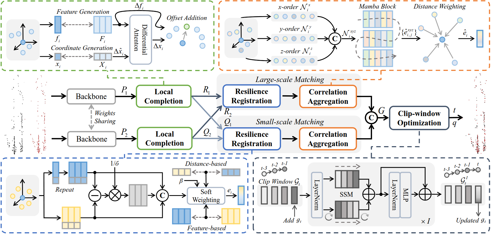

<h1 align="center"> CAO-RONet: A Robust 4D Radar Odometry with Exploring More Information from Low-Quality Points </h1>

<div align="center">

**Zhiheng Li**, Yubo Cui, Ningyuan Huang, Chenglin Pang, Zheng Fang*

[](https://arxiv.org/abs/2503.01438)

</div>

## Absract

Recently, 4D millimetre-wave radar exhibits more stable perception ability than LiDAR and camera under adverse conditions (e.g. rain and fog). However, low-quality radar points hinder its application, especially the odometry task that requires a dense and accurate matching. To fully explore the potential of 4D radar, we introduce a learning-based odometry framework, enabling robust ego-motion estimation from finite and uncertain geometry information. First, for sparse radar points, we propose a local completion to supplement missing structures and provide denser guideline for aligning two frames. Then, a context-aware association with a hierarchical structure flexibly matches points of different scales aided by feature similarity, and improves local matching consistency through correlation balancing. Finally, we present a window-based optimizer that uses historical priors to establish a coupling state estimation and correct errors of inter-frame matching. The superiority of our algorithm is confirmed on View-of-Delft dataset, achieving around a 50% performance improvement over previous approaches and delivering accuracy on par with LiDAR odometry.

## Overview

<p align="center">
    
</p>

The overview of our proposed CAO-RONet. At first, the two frames of radar features derived from backbone are fed into LCM to densify sparse points. Then, CAM implements feature-assisted registration to associate point pairs in different scales, followed by correlation balancing to suppress outliers. Finally, COM with sequential state modeling applies historical prior from clip window to constraint the current ego-motion prediction and smooth trajectory.

## Quickstart

### 0. Data Download
Please refer to [CMFlow](https://github.com/Toytiny/CMFlow/blob/master/src/GETTING_STARTED.md) for this section, which provides a detailed description.           
Our data structure is as follows:
```
├──CAO-RONet
 ├──data
  ├──Delft
    ├── radar (kitti dataset where velodyne contains the radar point clouds)
    │   │── ImageSets
    │   │── training
    │   │   ├──calib & velodyne & image_2 & label_2
    │   │── testing
    │       ├──calib & velodyne & image_2
    ├── lidar (kitti dataset where velodyne contains the LiDAR point clouds)
    ├── radar_3_scans (kitti dataset where velodyne contains the accumulated radar point clouds of 3 scans)
    ├── radar_5_scans (kitti dataset where velodyne contains the radar point clouds of 5 scans)
```

### 1. Environment Setup
Our code is implemented on Python 3.8 with Pytorch 2.1.0 and CUDA 11.8. To reproduce and use our environment, you can use the following command:

a. Clone the repository to local
```
git clone https://github.com/NEU-REAL/CAO-RONet.git
cd CAO-RONet
```               
b. Set up a new environment with Anaconda
```
conda create -n ronet python=3.8
conda activate ronet
```                       
c. Install common dependices and pytorch
```
pip install torch==2.1.0 torchvision==0.16.0 torchaudio==2.1.0 --index-url https://download.pytorch.org/whl/cu118
pip install -r requirements.txt

# Please note that if "ImportError: cannot import name packaging from pkg.sources" appears, please perform this operation
pip install --upgrade setuptools pip
```                      
d. Install PointNet++ library for basic point cloud operation
```
pip install "git+https://github.com/erikwijmans/Pointnet2_PyTorch.git#egg=pointnet2_ops&subdirectory=pointnet2_ops_lib"
```

### 2. Data Preprocess
You need to preprocess the original dataset into our odometry format.       
```
# for original data
python preprocess/preprocess_vod_odm.py --root_dir $ROOT_DIR$ --save_dir $SAVE_DIR$
# for example
# python preprocess/preprocess_vod_odm.py --root_dir data/Delft --save_dir data/Delft/odm
```
where `$ROOT_DIR$` is the path of VoD dataset. The odometry samples are saved under the `$SAVE_DIR$/odom_smp/`.                
**Please note** that it is normal for some errors to occur during preprocessing, please refer to [CMFlow](https://github.com/Toytiny/CMFlow/blob/master/src/GETTING_STARTED.md)'s explanation.

As mentioned in our paper, we perform data augmentation to produce more samples.
```
# for more data
python preprocess/preprocess_vod_odm_reverse.py --root_dir $ROOT_DIR$
# for example
# python preprocess/preprocess_vod_odm_reverse.py --root_dir data/Delft/odm/odm_smp/train/
```
**Please note** that the correspondence between the generated sequence names and paper sequence is as follows:
```
delft_1 -> 00, delft_4 -> 03, delft_6 -> 04, delft_9 -> 07, delft_27 -> 23
```

### 3. Model Training
Running the following command to start training.
```
python main_odm.py --dataset_path $DATA_PATH$ --exp_name $EXP_NAME$  --model ronet --dataset vodClipDatasetOdm
# for example
# python main_odm.py --dataset_path data/Delft/odm/odm_smp/ --exp_name baseline --model ronet --dataset vodClipDatasetOdm
```
`$DATA_PATH$` is the path where you save your preprocessed odometry samples. `$EXP_NAME$` is the name of the current experiment defined by yourself. Training logs and results will be saved under `checkpoints/$EXP_NAME$/`. 

Besides, you can also modify training args, such as batch size, learning rate and number of epochs, by editing the configuration file `configs.yaml`.

### 4. Model Evaluation
Running the following command to start evaluation.
```
python main_odm.py --eval --dataset_path $DATA_PATH$ --exp_name $EXP_NAME$  --model ronet --dataset vodClipDatasetOdm
# for example
# python main_odm.py --eval --dataset_path data/Delft/odm/odm_smp/ --exp_name baseline --model ronet --dataset vodClipDatasetOdm
```
Once the evaluation is completed, the results on different metrics will be printed.

If you want to reproduce the results of the paper, we provide a pre-trained model on [OneDrive](https://1drv.ms/f/s!At4_yzPIbj7OcEWYZVYvh04o6pI?e=5SOrf9). And you need to place the folder named `$pretrained_model`$ at `$checkpoints/`$.
```
python main_odm.py --eval --dataset_path data/Delft/odm/odm_smp/ --exp_name pretrained_model --model ronet --dataset vodClipDatasetOdm
```

## Acknowledgement

This repo is based on [CMFlow](https://github.com/Toytiny/CMFlow), we are very grateful for their excellent work.                     
We are also very grateful for the support and assistance of Shouyi Lu, the author of [4DRO-Net](https://ieeexplore.ieee.org/document/10237296/).

## Citation

If you find our repository useful, please consider citing us as
```
@article{li2025cao,
  title={CAO-RONet: A Robust 4D Radar Odometry with Exploring More Information from Low-Quality Points},
  author={Li, Zhiheng and Cui, Yubo and Huang, Ningyuan and Pang, Chenglin and Fang, Zheng},
  journal={arXiv preprint arXiv:2503.01438},
  year={2025}
}
```
